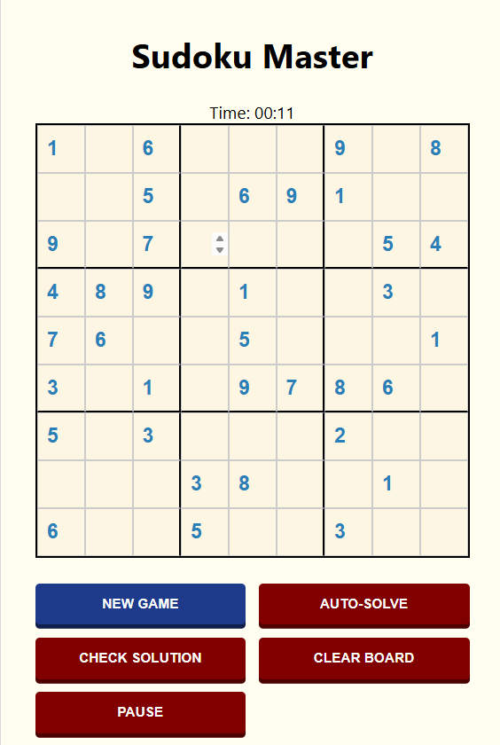
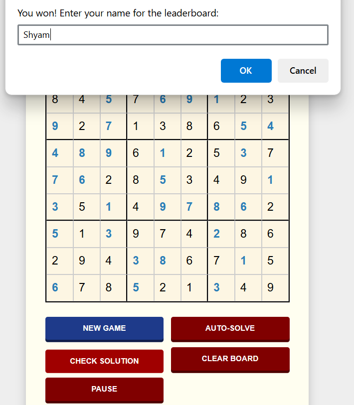
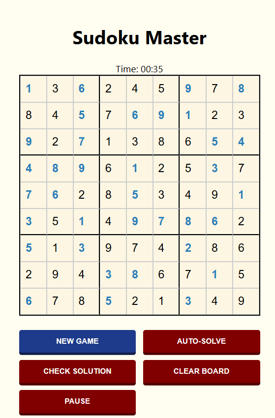
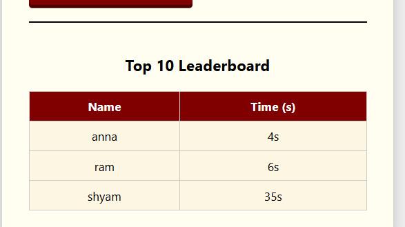

## Technical Architecture & Pipeline

The application follows a **Three-Tier Architecture**, separating the user interface, the server logic, and the persistent storage.

### 1. The Data Pipeline (Request-Response Cycle)
When a user successfully completes a puzzle, the following lifecycle occurs:

1.  **Client-Side Validation:** `script.js` validates the grid. If correct, it captures the user's name via a prompt and calculates the final time in seconds.
2.  **API Request (POST):** The browser uses the `Fetch API` to send a JSON payload to the backend:
    * **Endpoint:** `http://localhost:3000/save-score`
    * **Payload:** `{ "name": "User", "time": 120 }`
3.  **Middleware Processing:** The **Express** server receives the request, passes it through `cors()` (to allow cross-origin communication) and `express.json()` (to parse the body).
4.  **Database Persistence:** The server executes an asynchronous SQL query via **sqlite3** to insert the record into the `leaderboard` table.
5.  **State Synchronization:** Upon a successful save, the frontend sends a **GET** request to `/scores` to fetch the updated Top 10 list and re-renders the leaderboard table dynamically.

### 2. Dependencies
This project utilizes a lightweight but powerful stack to ensure local performance and ease of deployment.

| Dependency | Category | Role |
| :--- | :--- | :--- |
| **Express.js** | Backend Framework | Managed the RESTful API endpoints and HTTP routing. |
| **SQLite3** | Database | A serverless, disk-based storage engine used to store high scores locally in `sudoku.db`. |
| **CORS** | Security | Enabled Cross-Origin Resource Sharing, allowing the frontend to securely communicate with the local Node.js server. |
| **Node.js** | Runtime Environment | The core engine used to execute JavaScript on the server-side. |

### 3. Core Logic: The MRV Backtracking Solver
The solver is built using a Recursive Backtracking algorithm. To optimize the $9 \times 9$ search space, it implements the **Minimum Remaining Values (MRV)** heuristic:
* Instead of picking the next available empty cell, the algorithm scans for the cell with the **fewest possible legal moves**.
* This "fail-fast" approach prunes the search tree early, resulting in near-instant solutions for even "Hard" rated puzzles.

## 📸 Gallery

| New Game State | Solved State |
| :---: | :---: |
|  |  |

| Win Notification | Top-10 Leaderboard |
| :---: | :---: |
|  |  |